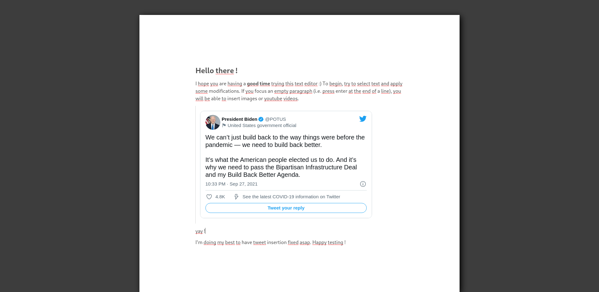

# Rich Text editor

:warning: __This repository is NOT production ready and is no longer maintained.__

It has been created as a proof of concept to illustrate the technical aspects of
[this article](https://knplabs.com/fr/blog/how-we-built-a-medium-like-rich-text-editor),
which has been published in january 2019. At the time the article was written,
this editor was still at experimental state. Therefore, lots of bugs and side
effects are still to be fixed.

You can still build the projet and run it localy to test the editing features :)

## Preview



## Architecture

The application uses a nodejs service to bypass CORS restrictions of some APIs
(i.e. twitter). That is, front and server components both have their dedicated
folder:

```
rich-text-editor
  |_ front        # react application
  |_ server       # nodejs application (to bypass CORS restrictions)
```

## Installation

You will need docker and docker-compose to run this project on your local env.

```
$ git clone git@github.com:jaljo/rich-text-editor.git
$ cd rich-text-editor
$ make dev
```

You can now access the project by browsing [localhost:5000/](http://localhost:5000/)

## Tests

To run the tests localy:

```
$ make test
```
